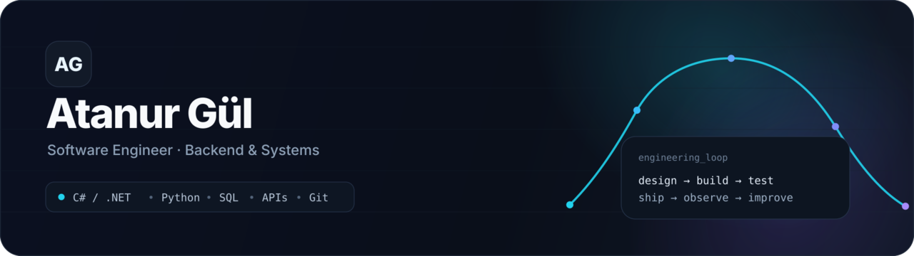

<picture>
  <source media="(prefers-color-scheme: dark)" srcset="./hero-dark.png">
  <source media="(prefers-color-scheme: light)" srcset="./hero-light.png">
  
</picture>

 

// ABOUT

Software Engineer focused on backend development, APIs, databases and software engineering practices.

I care about understanding the whole lifecycle of a system — from requirements and design to testing, deployment and improvement.

<table>
<tr>
<td width="33%" valign="top">

⚙️ Building

C# / .NET & SQL

Backend-oriented projects with a focus on structure, data and maintainability.

</td>
<td width="33%" valign="top">

🧠 Deepening

APIs · Testing · Architecture

Improving how I design systems, reason about trade-offs and verify software.

</td>
<td width="33%" valign="top">

🚀 Next

Docker · CI/CD · Observability

Moving from “it works” toward software that can be shipped and operated reliably.

</td>
</tr>
</table>

// SELECTED WORK

<table>
<tr>
<td width="50%" valign="top">

🎓 Course Registration System

A course registration application built around a relational model for students, courses and enrollments.

Focus

relational database design

constraints & relationships

SQL Server integration

.NET data access

View repository →

</td>

<td width="50%" valign="top">

📚 Library Management API

A library management system combining OOP, REST API development and automated testing.

Focus

RESTful API design

object-oriented structure

automated tests

FastAPI

View repository →

</td>
</tr>

<tr>
<td width="50%" valign="top">

🍷 Wine Quality Classification

A machine-learning classification project using chemical properties from the UCI Wine Quality dataset.

Focus

preprocessing

SMOTE

GridSearchCV

model evaluation

View repository →

</td>

<td width="50%" valign="top">

🧪 Next Build

The next project will go deeper into production-oriented engineering practices.

Planned focus

API architecture

automated testing

Docker

CI/CD

deployment

building...

</td>
</tr>
</table>

// TOOLBOX

Core

Backend & Data

Engineering

// ENGINEERING LOOP

┌──────────────────────────────────────────────────────────────┐
│                                                              │
│   requirements                                               │
│        ↓                                                     │
│   design → database & api                                    │
│        ↓                                                     │
│   implementation                                             │
│        ↓                                                     │
│   test & debug                                               │
│        ↓                                                     │
│   ship → observe → improve                                   │
│                                                              │
└──────────────────────────────────────────────────────────────┘

Build software you can explain, test, ship and improve.

// CURRENT FOCUS

focus:
  backend:
    - C# / .NET
    - REST API design
    - SQL & relational modeling

  engineering:
    - testing
    - debugging
    - architecture
    - code review

  next:
    - Docker
    - CI/CD
    - deployment
    - observability
    - system design

software engineering · backend · systems

 

From implementation to engineering.

